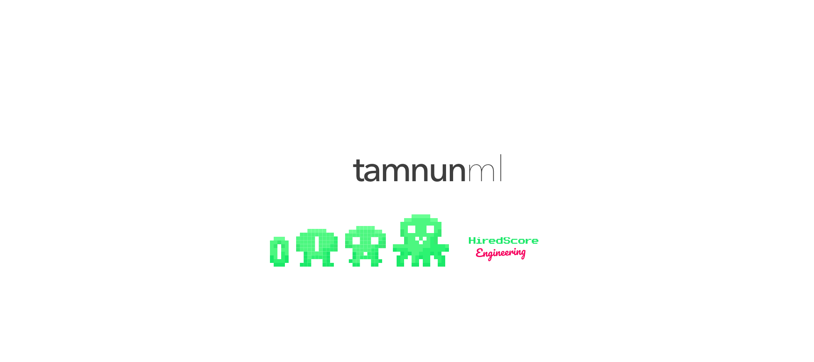

# Tamnun ML

`tamnun` is a python framework for Machine and Deep learning algorithms and methods especially in the field of Natural Language Processing and Transfer Learning. The aim of `tamnun` is to provide an easy to use interfaces to build powerful models based on most recent SOTA methods.

For more about `tamnun`, feel free to read [the introduction to TamnunML on Medium](https://medium.com/hiredscore-engineering/introducing-octoml-73bd527491b1).

# Getting Started

`tamnun` depends on several other machine learning and deep learning frameworks like `pytorch`, `keras` and others. To install `tamnun` and all it's dependencies run:

```
$ git clone https://github.com/hiredscorelabs/tamnun-ml
$ cd tamnun-ml
$ python setup.py install
```

Or install directly from Github:

```
pip install git+https://github.com/hiredscorelabs/tamnun-ml
```

Jump in and try out an example:

```
$ cd examples
$ python finetune_bert.py
```

Or take a look at the Jupyer notebooks [here](notebooks).

## BERT

*BERT* stands for Bidirectional Encoder Representations from Transformers which is a language model trained by Google and introduced in their [paper](https://arxiv.org/abs/1810.04805).
Here we use the excellent [PyTorch-Pretrained-BERT](https://pypi.org/project/pytorch-pretrained-bert/) library and wrap it to provide an easy to use [scikit-learn](https://scikit-learn.org/) interface for easy BERT fine-tuning. At the moment, `tamnun` BERT classifier supports binary and multi-class classification. To fine-tune BERT on a specific task:

```python
from tamnun.bert import BertClassifier, BertVectorizer
from sklearn.pipeline import make_pipeline

clf = make_pipeline(BertVectorizer(), BertClassifier()).fit(train_X, train_y)
predicted = clf.predict(test_X)
```

Please see [this notebook](https://github.com/hiredscorelabs/tamnun-ml/blob/master/notebooks/finetune_bert.ipynb) for full code example.

## Distiller Transfer Learning

This module distills a very big (like BERT) model into a much smaller model. Inspired by this [paper](https://arxiv.org/abs/1503.02531).

```python
from tamnun.bert import BertClassifier, BertVectorizer
from tamnun.transfer import Distiller

bert_clf =  make_pipeline(BertVectorizer(do_truncate=True, max_len=3), BertClassifier())
distilled_clf = make_pipeline(CountVectorizer(ngram_range=(1,3)), LinearRegression())

distiller = Distiller(teacher_model=bert_clf, teacher_predict_func=bert_clf.decision_function, student_model=distilled_clf).fit(train_texts, train_y, unlabeled_X=unlabeled_texts)

predicted_logits = distiller.transform(test_texts)
```

For full BERT distillation example see [this](https://github.com/hiredscorelabs/tamnun-ml/blob/master/notebooks/distill_bert.ipynb) notebook.


# Support

## Getting Help

You can ask questions and join the development discussion on [Github Issues](https://github.com/hiredscorelabs/tamnun-ml/issues)


## License

Apache License 2.0 (Same as Tensorflow)

